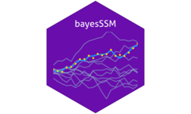
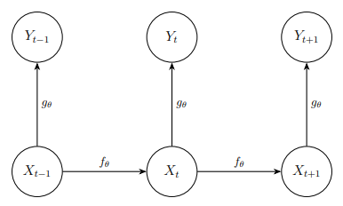

<!-- README.md is generated from README.Rmd. Please edit that file -->

# bayesSSM 

<!-- badges: start -->

[](https://app.codecov.io/gh/BjarkeHautop/bayesSSM)
[](https://github.com/BjarkeHautop/bayesSSM/actions/workflows/R-CMD-check.yaml)
<!-- badges: end -->

bayesSSM is an R package offering a set of tools for performing Bayesian
inference in state-space models (SSMs). It implements the Particle
Marginal Metropolis-Hastings (PMMH) in the main function `pmmh` for
Bayesian inference in SSMs.

## Why bayesSSM?

While there are several alternative packages available for performing
Particle MCMC, bayesSSM is designed to be simple and easy to use. It was
alongside my Master’s thesis about Particle MCMC, since I was
implementing everything from scratch anyway. Everything is written in R,
so performance is not the best.

## Installation

You can install the latest stable version of bayesSSM from CRAN with:

``` r
install.packages("bayesSSM")
```

or the development version from GitHub with:

``` r
# install.packages("pak")
pak::pak("BjarkeHautop/bayesSSM")
```

## Example

Consider the following SSM:

$$
\begin{aligned}
        X_0 &\sim N(0,1) \\
        X_t&=\phi X_{t-1}+\sin(X_{t-1})+\sigma_x V_t, \quad V_t \sim N(0,1), \quad t\geq 1 \\
        Y_t&=X_t+\sigma_y W_t, \quad W_t \sim N(0, 1), \quad t\geq 1 
\end{aligned}
$$

Let’s first simulate 20 data points from this model with $\phi = 0.8$,
$\sigma_x = 1$, and $\sigma_y = 0.5$.

``` r
set.seed(1405)
t_val <- 20
phi <- 0.8
sigma_x <- 1
sigma_y <- 0.5

init_state <- rnorm(1, mean = 0, sd = 1)
x <- numeric(t_val)
y <- numeric(t_val)
x[1] <- phi * init_state + sin(init_state) +
  rnorm(1, mean = 0, sd = sigma_x)
y[1] <- x[1] + rnorm(1, mean = 0, sd = sigma_y)
for (t in 2:t_val) {
  x[t] <- phi * x[t - 1] + sin(x[t - 1]) + rnorm(1, mean = 0, sd = sigma_x)
  y[t] <- x[t] + rnorm(1, mean = 0, sd = sigma_y)
}
x <- c(init_state, x)
```

We define the priors for our model as follows:

$$
\begin{aligned}
        \phi &\sim \text{Uniform}(0,1), \\
        \sigma_x &\sim \text{Exp}(1), \\
        \sigma_y &\sim \text{Exp}(1).
\end{aligned}
$$

We can use `pmmh` to perform Bayesian inference on this model. To use
`pmmh` we need to define the functions for the SSM and the priors.

The functions `init_fn`, `transition_fn` should be functions that
simulates the latent states. `init_fn` must contain the argument
`num_particles` for initializing the particles, and `transition_fn` must
contain the argument `particles`, which is a vector of particles, and
can contain any other arguments for model-specific parameters.

The function `log_likelihood_fn` should be a function that calculates
the log-likelihood of the observed data given the latent state
variables. It must contain the arguments `y` for the data and
`particles`. Time-dependency can be implemented by giving a `t` argument
in `transition_fn` and `log_likelihood_fn`.

``` r
init_fn <- function(num_particles) {
  rnorm(num_particles, mean = 0, sd = 1)
}
transition_fn <- function(particles, phi, sigma_x) {
  phi * particles + sin(particles) +
    rnorm(length(particles), mean = 0, sd = sigma_x)
}
log_likelihood_fn <- function(y, particles, sigma_y) {
 dnorm(y, mean = particles, sd = sigma_y, log = TRUE)
}
```

The priors for the parameters must be defined as log-prior functions.
Every parameter from `init_fn`, `transition_fn`, and `log_likelihood_fn`
must have a corresponding log-prior function.

``` r
log_prior_phi <- function(phi) {
  dunif(phi, min = 0, max = 1, log = TRUE)
}
log_prior_sigma_x <- function(sigma) {
  dexp(sigma, rate = 1, log = TRUE)
}
log_prior_sigma_y <- function(sigma) {
  dexp(sigma, rate = 1, log = TRUE)
}

log_priors <- list(
  phi = log_prior_phi,
  sigma_x = log_prior_sigma_x,
  sigma_y = log_prior_sigma_y
)
```

Now we can run the PMMH algorithm using the `pmmh` function. For this
README we use a lower number of samples and a smaller burn-in period,
and also modify the pilot chains to only use 200 samples. This is to
make the example run faster.

``` r
library(bayesSSM)

result <- pmmh(
  y = y,
  m = 500, # number of MCMC samples
  init_fn = init_fn,
  transition_fn = transition_fn,
  log_likelihood_fn = log_likelihood_fn,
  log_priors = log_priors,
  pilot_init_params = list(
    c(phi = 0.4, sigma_x = 0.4, sigma_y = 0.4),
    c(phi = 0.8, sigma_x = 0.8, sigma_y = 0.8)
  ),
  burn_in = 50,
  num_chains = 2,
  seed = 1405,
  tune_control = default_tune_control(pilot_m = 200, pilot_burn_in = 10)
)
#> Running chain 1...
#> Running pilot chain for tuning...
#> Using 298 particles for PMMH:
#> Running Particle MCMC chain with tuned settings...
#> Running chain 2...
#> Running pilot chain for tuning...
#> Using 242 particles for PMMH:
#> Running Particle MCMC chain with tuned settings...
#> PMMH Results Summary:
#>  Parameter Mean   SD Median 2.5% 97.5% ESS  Rhat
#>        phi 0.78 0.08   0.79 0.61  0.96 102 1.007
#>    sigma_x 0.50 0.41   0.36 0.02  1.18   8 1.388
#>    sigma_y 0.88 0.42   1.04 0.09  1.37   7 1.393
#> Warning in pmmh(y = y, m = 500, init_fn = init_fn, transition_fn =
#> transition_fn, : Some ESS values are below 400, indicating poor mixing.
#> Consider running the chains for more iterations.
#> Warning in pmmh(y = y, m = 500, init_fn = init_fn, transition_fn = transition_fn, : 
#> Some Rhat values are above 1.01, indicating that the chains have not converged. 
#> Consider running the chains for more iterations and/or increase burn_in.
```

We get convergence warnings as expected due to the small number of
iterations.

## State-space Models

A state-space model (SSM) has the structure given in the following
diagram, where we omitted potential time-dependency in the transition
and observation densities for simplicity.



The core function, `pmmh`, implements the Particle Marginal
Metropolis-Hastings, which is an algorithm that first generates a set of
$N$ particles to approximate the likelihood and then uses this
approximation in the acceptance probability. The implementation
automatically tunes the number of particles and the proposal
distribution for the parameters.
